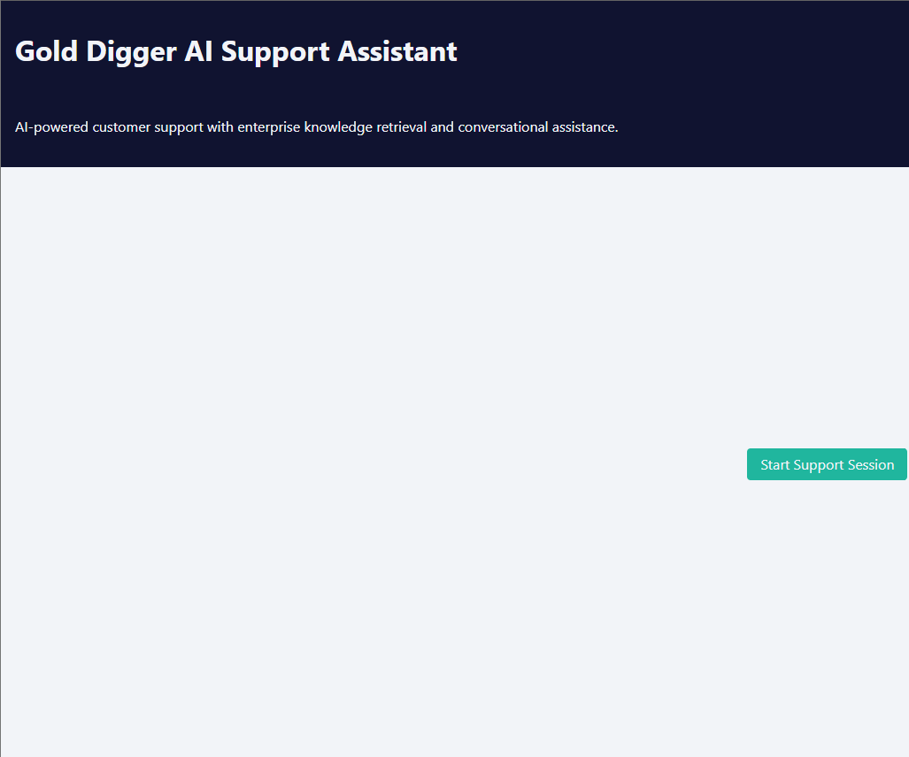
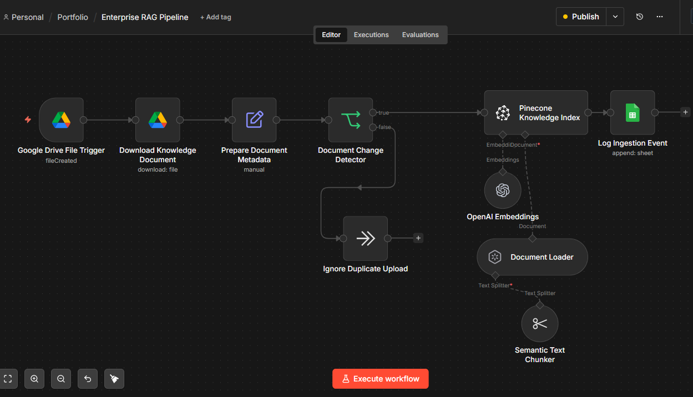
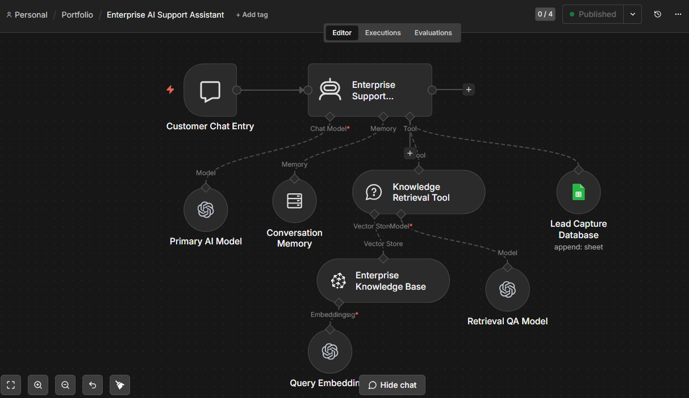
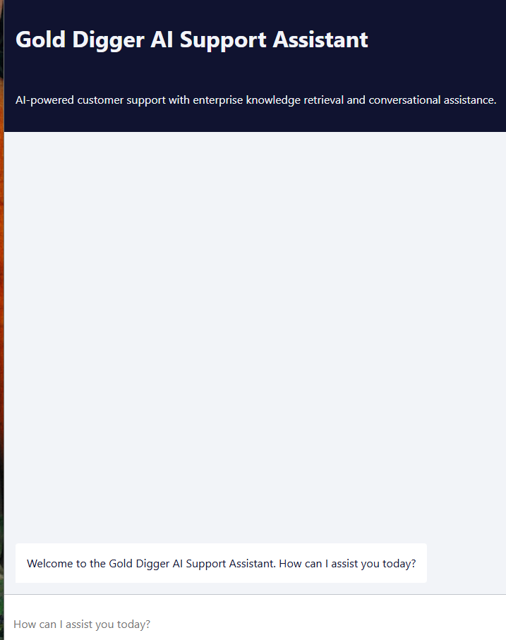
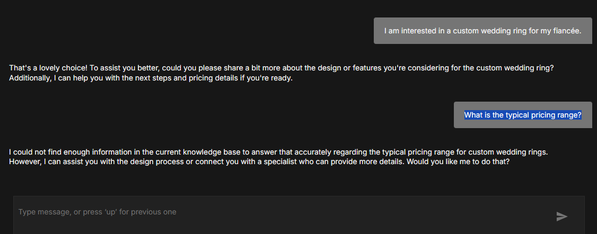
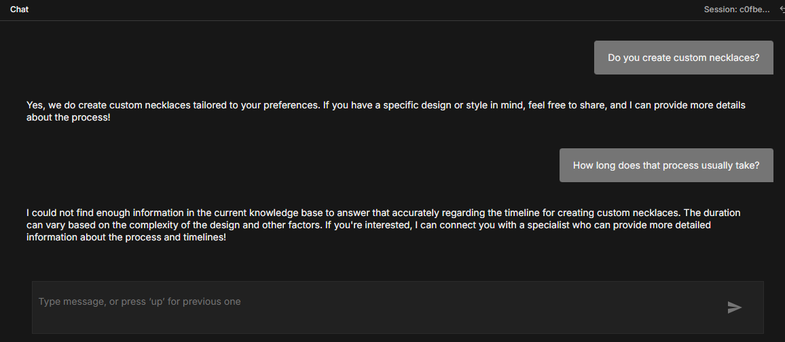
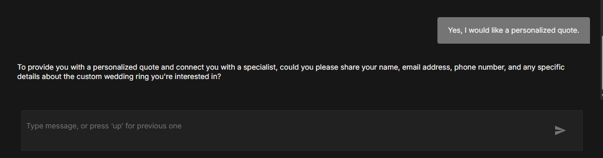
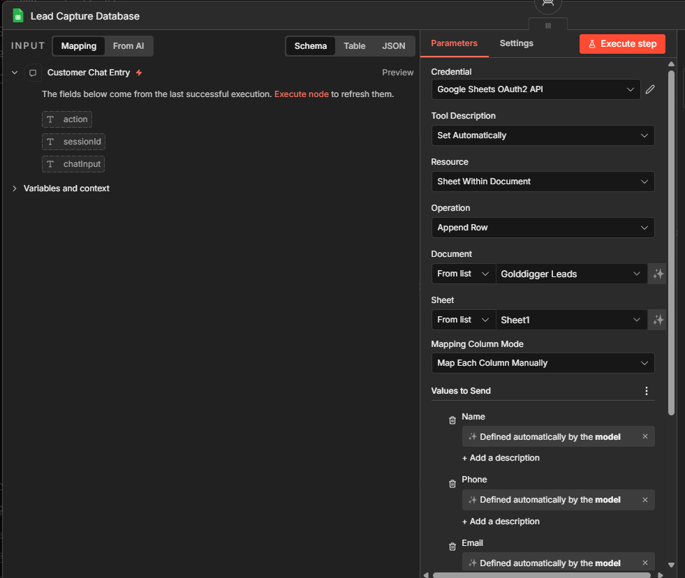
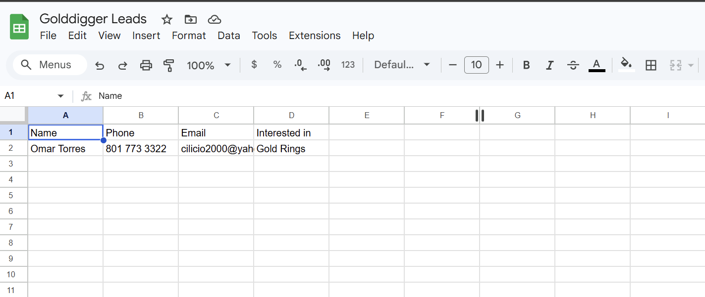

# Enterprise AI Support Assistant

AI-powered customer support assistant using Retrieval-Augmented Generation (RAG), Pinecone vector search, conversational memory, and lead qualification workflows built with n8n.

---



## Overview

This project demonstrates a production-style AI customer support system designed for enterprise environments.

The solution combines:

- AI conversational support
- Retrieval-Augmented Generation (RAG)
- Pinecone vector search
- Conversational memory
- Lead qualification workflows
- Google Sheets CRM-style lead capture
- Automated document ingestion pipelines

The system is designed to provide grounded AI responses using enterprise knowledge retrieval while avoiding hallucinated answers when information is unavailable.

---

## Key Features

### Enterprise Knowledge Retrieval
Uses Pinecone vector search with semantic chunking and OpenAI embeddings to retrieve relevant business knowledge.

### Grounded AI Responses
The assistant avoids fabricating information and responds transparently when verified context is unavailable.

### Conversational Memory
Maintains session context across multiple customer interactions.

### Lead Qualification
Detects purchase intent and escalates users into a structured lead capture flow.

### Automated Knowledge Ingestion
Documents uploaded to Google Drive are automatically processed, chunked, embedded, and indexed into Pinecone.

### Operational Logging
Tracks ingestion activity and lead capture events through Google Sheets integrations.

---

# System Architecture

## RAG Ingestion Pipeline

This workflow automatically processes and indexes enterprise knowledge documents into Pinecone.

### Pipeline Responsibilities

- Google Drive document ingestion
- Metadata preparation
- Duplicate detection
- Semantic chunking
- OpenAI embeddings generation
- Pinecone vector indexing
- Ingestion event logging



---

## AI Support Assistant Workflow

This workflow powers the conversational AI assistant and orchestrates retrieval, memory, and lead capture operations.

### Assistant Capabilities

- Customer conversation handling
- Context-aware retrieval
- Memory persistence
- Lead qualification
- CRM-style lead capture
- Enterprise support orchestration



---

# User Experience

## Chat Interface

Enterprise-branded customer support interface built with n8n chat workflows.



---

## Grounded Retrieval Behavior

The assistant avoids hallucinated responses when verified knowledge is unavailable.

This demonstrates trust-aware AI behavior and retrieval grounding.



---

## Purchase Intent Detection

The assistant identifies potential customer purchase intent during conversations.


---

## Conversational Memory

Session memory allows the assistant to maintain context across interactions.



---

## Lead Qualification Flow

When purchase intent is identified, the assistant transitions into a structured lead qualification process.



---

# Operational Automation

## Lead Capture Workflow

Structured customer information is automatically processed and stored through Google Sheets integrations.



---

## Lead Capture Results

Captured customer leads are automatically persisted for business follow-up and CRM workflows.



---

# Technology Stack

- n8n
- OpenAI
- Pinecone
- Google Drive API
- Google Sheets API
- Retrieval-Augmented Generation (RAG)
- Vector Embeddings
- Conversational AI
- Semantic Search

---

# Project Structure

```text
enterprise-ai-support-assistant/
│
├── workflows/
│   ├── 01-enterprise-rag-pipeline.json
│   ├── 02-enterprise-ai-support-assistant.json
│
├── screenshots/
│   ├── hero-interface.png
│   ├── chat-interface.png
│   ├── workflow-rag-pipeline.png
│   ├── workflow-support-assistant.png
│   ├── grounded-fallback-response.png
│   ├── purchase-intent-conversation.png
│   ├── memory-context-demo.png
│   ├── lead-qualification-flow.png
│   ├── lead-capture-workflow.png
│   ├── lead-capture-results.png
│
├── README.md
│
└── LICENSE

# Security Notes

All exported workflows have been sanitized for public release.

Removed items include:

- API keys
- Credential IDs
- Webhook identifiers
- Pinecone index identifiers
- Google Sheets identifiers
- Internal execution metadata

---

# Future Improvements

- Multi-agent routing
- CRM integrations
- Human escalation workflows
- Multi-language support
- Analytics dashboard
- Voice support integrations
- Ticketing system integrations

---

# Author

Boris Villanueva

GitHub:
https://github.com/borisvillanueva
